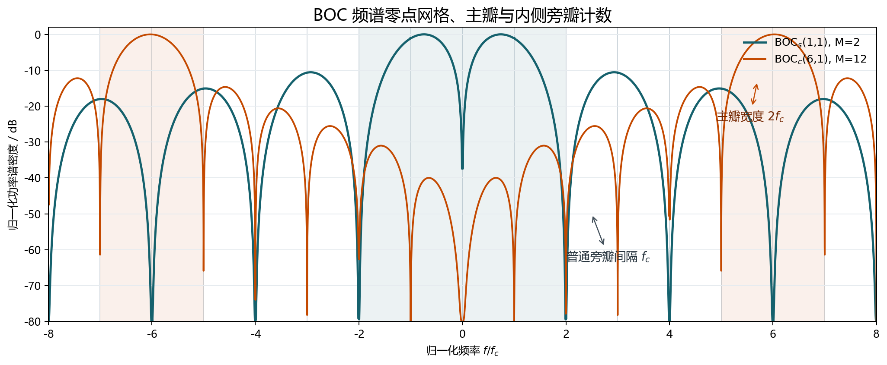
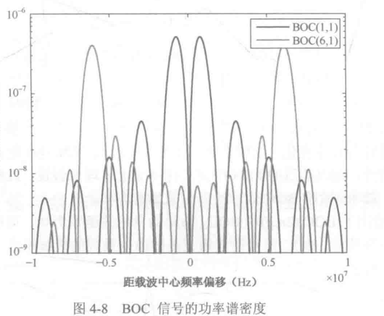

# 4.3.2 BOC 信号的功率谱密度

> 个人电子书主稿。  
> 本节按教材式 (4.11)--(4.18) 的顺序重写：先把 BOC 看成 BPSK-R 码片波形与方波副载波相乘，再从频域卷积走到单码片脉冲的傅里叶变换，最后用零点网格解释主瓣宽度、旁瓣宽度与 $M-2$

## 1. 本节主线：先看见频谱为什么会分裂 {#route}

BOC 调制最容易让人迷惑的地方，是它的功率谱密度最大值不再位于载波中心附近，而是分裂到载波中心两侧。教材 4.3.2 要说明的正是这件事。

先用一句话抓住主链：

$$
\text{方波副载波}
\longrightarrow
\text{奇次谐波}
\longrightarrow
\text{频谱搬移到 }\pm f_s
\longrightarrow
\text{主瓣、旁瓣与零点网格}
$$

教材给出的正弦相位方波副载波是

$$
\gamma(t)=\operatorname{sgn}\left[\sin(2\pi f_s t+\psi)\right]
\tag{4.11}
$$

BOC 信号可以看成 BPSK-R 扩频码片波形乘以这个方波副载波。时域相乘，对应频域卷积，所以教材写成

$$
P_{\mathrm{BOC}}(f)
=
P_{\mathrm{BPSK-R}}(f)*\Gamma(f)
\tag{4.12}
$$

其中

$$
\Gamma(f)=\mathcal{F}\{\gamma(t)\}
$$

方波副载波的关键性质是奇谐性：平移半个副载波周期后符号反转。若把完整副载波周期记为 $T_{\mathrm{per}}$，可写成

$$
\gamma(t)=-\gamma\left(t+\frac{T_{\mathrm{per}}}{2}\right)
\tag{4.13}
$$

下文为了和式 (4.15)--(4.18) 的谱公式保持一致，把方波电平保持不变的半周期记为

$$
T_s=\frac{1}{2f_s}
$$

于是奇谐性也可理解为

$$
\gamma(t)=-\gamma(t+T_s)
$$

因为方波只含奇次谐波，所以 $\Gamma(f)$ 是一串线谱，只在

$$
f=\pm(2k+1)f_s\qquad k=0,1,2\ldots
$$

附近出现奇次谐波项，线谱间隔为 $2f_s$，包络近似服从 $\operatorname{sinc}(\pi fT_s)$这就解释了为什么 BOC 的频谱会从中心频点向两侧搬移：它是在用方波副载波的奇次谱线去搬移原本的 BPSK-R 频谱。

### 1.1 为什么半波反对称只留下奇次谐波

上面这句话还可以更严格地从傅里叶级数看出来。为了避免和后面“半周期片段” $T_s$ 混淆，这里暂时把一个周期信号的完整周期记为 $T_{\mathrm{per}}$，基频为

$$
f_s=\frac{1}{T_{\mathrm{per}}}
$$

周期信号 $x(t)$ 的双边傅里叶级数可写成

$$
x(t)=
\sum_{n=-\infty}^{+\infty}
X_n e^{j2\pi nf_s t}
$$

其中 $X_n$ 是第 $n$ 次谐波的复振幅。因为指数项的频率就是 $nf_s$，所以“第 $n$ 次谐波”在频域中对应的谱线位置就是

$$
f=nf_s
$$

因此，“只含奇次谐波”的严格含义是：当 $n$ 为偶数时 $X_n=0$，只有当 $n$ 为奇数时 $X_n$ 可能不为 0。于是谱线自然只会出现在

$$
f=\pm f_s\ \pm 3f_s\ \pm 5f_s\ldots
$$

相邻奇次谱线之间相差

$$
3f_s-f_s=2f_s
$$

现在来看为什么半波反对称会造成这种筛选。傅里叶系数为

$$
X_n=
\frac{1}{T_{\mathrm{per}}}
\int_0^{T_{\mathrm{per}}}
x(t)e^{-j2\pi nf_s t}\,dt
$$

把积分拆成前后两个半周期：

$$
\begin{aligned}
X_n
&=
\frac{1}{T_{\mathrm{per}}}
\left[
\int_0^{T_{\mathrm{per}}/2}
x(t)e^{-j2\pi nf_s t}\,dt
+
\int_{T_{\mathrm{per}}/2}^{T_{\mathrm{per}}}
x(t)e^{-j2\pi nf_s t}\,dt
\right]
\end{aligned}
$$

对后半段令 $\tau=t-T_{\mathrm{per}}/2$，即 $t=\tau+T_{\mathrm{per}}/2$若信号满足半波反对称

$$
x\left(\tau+\frac{T_{\mathrm{per}}}{2}\right)=-x(\tau)
$$

则后半段积分变为

$$
\begin{aligned}
&\int_{T_{\mathrm{per}}/2}^{T_{\mathrm{per}}}
x(t)e^{-j2\pi nf_s t}\,dt\\
&=
\int_0^{T_{\mathrm{per}}/2}
x\left(\tau+\frac{T_{\mathrm{per}}}{2}\right)
e^{-j2\pi nf_s(\tau+T_{\mathrm{per}}/2)}\,d\tau\\
&=
-e^{-j\pi n}
\int_0^{T_{\mathrm{per}}/2}
x(\tau)e^{-j2\pi nf_s\tau}\,d\tau\\
&=
-(-1)^n
\int_0^{T_{\mathrm{per}}/2}
x(\tau)e^{-j2\pi nf_s\tau}\,d\tau
\end{aligned}
$$

所以两段合并后有

$$
X_n=
\frac{1-(-1)^n}{T_{\mathrm{per}}}
\int_0^{T_{\mathrm{per}}/2}
x(t)e^{-j2\pi nf_s t}\,dt
$$

关键就在因子 $1-(-1)^n$：

- 当 $n$ 为偶数时，$(-1)^n=1$，因此 $1-(-1)^n=0$，偶次谐波全部消失。
- 当 $n$ 为奇数时，$(-1)^n=-1$，因此 $1-(-1)^n=2$，奇次谐波被保留下来。

BOC 的方波副载波正是这种半波反对称信号，所以它会跳过直流和偶数倍频点，把主要谱线放在 $\pm f_s,\pm3f_s,\ldots$ 这些奇数倍基频附近。

### 1.2 如果是半波对称，会留下什么

如果把条件反过来，信号满足半波对称

$$
x\left(t+\frac{T_{\mathrm{per}}}{2}\right)=x(t)
$$

后半段积分就不再多出负号，而是

$$
\begin{aligned}
&\int_{T_{\mathrm{per}}/2}^{T_{\mathrm{per}}}
x(t)e^{-j2\pi nf_s t}\,dt\\
&=
e^{-j\pi n}
\int_0^{T_{\mathrm{per}}/2}
x(\tau)e^{-j2\pi nf_s\tau}\,d\tau\\
&=
(-1)^n
\int_0^{T_{\mathrm{per}}/2}
x(\tau)e^{-j2\pi nf_s\tau}\,d\tau
\end{aligned}
$$

于是

$$
X_n=
\frac{1+(-1)^n}{T_{\mathrm{per}}}
\int_0^{T_{\mathrm{per}}/2}
x(t)e^{-j2\pi nf_s t}\,dt
$$

这一次筛选因子变成 $1+(-1)^n$：

- 当 $n$ 为奇数时，$1+(-1)^n=0$，奇次谐波消失。
- 当 $n$ 为偶数时，$1+(-1)^n=2$，偶次谐波和直流分量保留下来。

所以半波对称信号的谱线会落在

$$
f=0\ \pm2f_s\ \pm4f_s\ldots
$$

也就是

$$
f=\pm2kf_s\qquad k=0,1,2\ldots
$$

从直观上说，半波对称意味着信号过了半个周期就已经重复一次，它真正的周期其实是 $T_{\mathrm{per}}/2$，真正基频是 $2f_s$如果仍然用原来的 $f_s$ 作尺度来数，它表现出来的就全是偶次谐波。

功率谱密度由频谱与其共轭相乘得到：

$$
G_{\mathrm{BOC}}(f)=P_{\mathrm{BOC}}(f)P_{\mathrm{BOC}}^*(f)
\tag{4.14}
$$

下面的问题就变成：怎样从一个码片内的方波片段，严格算出 $P_{\mathrm{BOC}}(f)$，再得到式 (4.15)--(4.18)？

## 2. 符号约定：$T_c$ 管码片，$T_s$ 管副载波片段 {#notation}

码片速率为 $f_c$，码片周期为

$$
T_c=\frac{1}{f_c}
$$

副载波频率为 $f_s$因为 BOC 副载波是方波，它每半个周期翻转一次，所以单个方波电平片段的长度为

$$
T_s=\frac{1}{2f_s}
$$

调制阶数 $M$ 就是一个码片里包含多少个这样的半周期片段：

$$
M=\frac{T_c}{T_s}=\frac{2f_s}{f_c}
$$

后面会反复用到两个等价关系：

$$
T_c=MT_s\qquad 2f_s=Mf_c
$$

这两个式子也可以从“一个码片里装了多少个半周期”来理解。$T_c=MT_s$ 说明：一个扩频码片的时长 $T_c$，正好由 $M$ 个方波副载波半周期 $T_s$ 拼起来。再从频率角度看，方波副载波频率为 $f_s$，由于一个周期包含两个半周期，所以“半周期片段”的翻转速率可理解为 $2f_s$；码速率为 $f_c$，两者之比就是

$$
\frac{2f_s}{f_c}=M
$$

因此 $2f_s=Mf_c$ 的含义也很直接：方波副载波半周期片段的速率是码速率的 $M$ 倍，而 $M$ 本身就表示一个扩频码片内有几个方波副载波半周期。

这个定义看上去只是符号选择，但它会让推导极其整齐。若把完整方波周期当作基本片段，每个码片内的片段数会多出一个 $1/2$；而把 $T_s$ 定义为半周期后，一个码片内正负电平的翻转次数就直接由 $M$ 表示。

这里还有一个极其重要的物理直觉：**时域信号越宽，其频域结构就越窄；反之，时域信号越窄，其频域结构就越宽**。

在数学上，傅里叶变换的尺度性质（Scaling Property）非常直观地体现了这一点：
$$
x\left(\frac{t}{a}\right) \longleftrightarrow aX(af)\qquad a>1
$$
如果将时域信号在时间轴上展宽 $a$ 倍，其对应的频谱不仅幅度被放大了 $a$ 倍，而且在频率轴上被等比例压缩了 $a$ 倍。

我们可以通过以下三个维度来完全、深度地理解这一核心概念：

#### 1. “宽”和“窄”的核心物理定义

* **时域的“宽”**：指信号的**持续时间（时长）越长**，即信号在时间轴上存在的时间长、脉冲宽度大。
* **频域的“窄”**：指信号在频率轴上占用的**有效带宽越小**，即频率成分越集中，能量分布越紧凑。

#### 2. 两个极端情况的物理直觉

通过观察两个极端的信号形式，最容易建立深刻的时频直觉：

* **直流信号（时域无限宽 $\rightarrow$ 频域无限窄）**
  一个信号如果从无限过去到无限未来都完全恒定不变（如 $x(t) = 1$），它的持续时间无限长（时域无限宽）。正因为它完全没有变化和起伏，它内部不包含任何交流波动分量，因此它的频率只有 $0\text{ Hz}$。在频域上，它只表现为一个位于零频点的狄拉克冲激函数 $\delta(f)$（频域无限窄，宽度为 0）。
* **冲激信号（时域无限窄 $\rightarrow$ 频域无限宽）**
  一个只在瞬间闪过、持续时间趋近于零的狄拉克 $\delta(t)$ 冲激脉冲（时域无限窄）。这种瞬间发生且变化无限剧烈的极致突变，在物理上必须叠加无数种不同频率的余弦波进行精确相长干涉与相消干涉才能组合而成。因此它在频谱上表现为平坦的常数 1（频域无限宽，拥有从零到无穷大的所有频率分量）。

#### 3. 物理本质：变化越慢，频率越低

从信号变化的物理本质来看：

* 如果一个信号在时域上很“宽”（波形平缓展宽，比如周期极长的长码片），说明它在时间轴上的**电平或状态变化得非常缓慢**。由于变化慢，其内部自然不需要高频率、剧烈波动的正弦分量来描述，因此其频谱必然会向低频段靠拢并紧缩起来，表现为频域变窄。
* 反之，如果信号在时域上很“窄”（波形在极短时间内完成跳变与归零），说明它**在时域变化极快**。任何“急刹车”、“突变沿”或“尖锐拐角”都需要极大量的高频成分才能拼接出来，因此其频域波形必然会被强力展宽。

> **🌟 物理学与信息论的铁律：时频局域化原理（Time-Frequency Localization）**
> 无论是经典力学、声学、信息论，还是量子力学中的海森堡不确定性原理，都遵循相同的数学根基——**时域宽度 $\Delta t$ 与频域宽度 $\Delta f$ 的乘积存在一个下限（即 $\Delta t \cdot \Delta f \ge C$）**。
> 这意味着我们绝不可能创造出一个在时域和频域中同时无限窄的物理信号。时域上要想拉长信号（如 $T_c$ 变长），频域必然发生压缩（零点网格变细密）；时域上要想压缩信号（如 $T_s$ 很短），频域必定发生扩张（副载波包络向外撑开）。

这就是为什么 $T_c$ 与 $T_s$ 会同时且分工明确地出现在归一化功率谱公式里：**较宽的码片窗口 $T_c$ 决定了频域上细密、紧缩的零点“筛网”网格；而较窄的方波半周期 $T_s$ 则以强力外扩的频域包络，决定了能量的搬移距离与大体分布。**

## 3. 正弦相位 BOC：从单码片脉冲开始 {#sine-derivation}

先只看一个码片 $0\le t<T_c$ 内的 BOC 基本脉冲。正弦相位方波在相邻半周期内交替取正负号，所以可以把单码片脉冲写成

$$
p_s(t)=
\sum_{k=0}^{M-1}(-1)^k
\mathbf{1}_{[kT_s,(k+1)T_s)}(t)
$$

其中 $\mathbf{1}_{[kT_s,(k+1)T_s)}(t)$ 是区间指示函数：只有当 $t$ 落在第 $k$ 个副载波半周期内时，它才等于 1。

这里的 $p_s(t)$ 要理解成“一个完整码片内的复合脉冲”，而不是普通矩形脉冲。它的外层长度是 $T_c$，内部却填入了 $M$ 个方波副载波半周期片段。换句话说，副载波的翻转并没有另外形成一个独立的随机符号序列，而是被包进了单个码片脉冲 $p_s(t)$ 的内部。后面计算 $P_s(f)$ 时，$T_s$ 不会消失；它会藏在每个小积分的上下限、交替符号 $(-1)^k$，以及最终的 $\sin(\pi fT_s)$、$\cos(\pi fT_s)$ 结构里。

### 3.1 为什么推导里会出现复指数

连续时间傅里叶变换的定义为

$$
X(f)=\int_{-\infty}^{\infty}x(t)e^{-j2\pi ft}\,dt
$$

这里的 $e^{-j2\pi ft}$ 是傅里叶变换的基函数。由欧拉公式

$$
e^{-j\theta}=\cos\theta-j\sin\theta
$$

可知，它本质上是在用复正弦基函数测量信号在频率 $f$ 上的投影。

把 $p_s(t)$ 代入傅里叶变换。由于指示函数把信号限制在 $M$ 个小区间内，原来的全时域积分会被切成 $M$ 段：

$$
P_s(f)
=
\sum_{k=0}^{M-1}(-1)^k
\int_{kT_s}^{(k+1)T_s}
e^{-j2\pi ft}\,dt
$$

### 3.2 先算一个半周期小片段

对其中一段积分，有

$$
\int_{kT_s}^{(k+1)T_s}e^{-j2\pi ft}\,dt
=
\left[
\frac{e^{-j2\pi ft}}{-j2\pi f}
\right]_{kT_s}^{(k+1)T_s}
$$

代入上下限：

$$
=
\frac{e^{-j2\pi f(k+1)T_s}-e^{-j2\pi fkT_s}}
{-j2\pi f}
$$

把分子顺序对调，消掉分母负号：

$$
=
\frac{e^{-j2\pi fkT_s}-e^{-j2\pi f(k+1)T_s}}
{j2\pi f}
$$

再提出公因式 $e^{-j2\pi fkT_s}$：

$$
=
\frac{
e^{-j2\pi fkT_s}\left(1-e^{-j2\pi fT_s}\right)
}
{j2\pi f}
$$

于是

$$
\int_{kT_s}^{(k+1)T_s}e^{-j2\pi ft}\,dt
=
\frac{1-e^{-j2\pi fT_s}}{j2\pi f}
\left(e^{-j2\pi fT_s}\right)^k
$$

### 3.3 代回求和，得到等比数列

将上式代回 $P_s(f)$：

$$
\begin{aligned}
P_s(f)
&=
\sum_{k=0}^{M-1}(-1)^k
\left[
\frac{1-e^{-j2\pi fT_s}}{j2\pi f}
\left(e^{-j2\pi fT_s}\right)^k
\right]\\
&=
\frac{1-e^{-j2\pi fT_s}}{j2\pi f}
\sum_{k=0}^{M-1}
(-1)^k
\left(e^{-j2\pi fT_s}\right)^k\\
&=
\frac{1-e^{-j2\pi fT_s}}{j2\pi f}
\sum_{k=0}^{M-1}
\left(-e^{-j2\pi fT_s}\right)^k
\end{aligned}
$$

最后一项是有限等比数列。令

$$
q=-e^{-j2\pi fT_s}
$$

则

$$
\sum_{k=0}^{M-1}q^k
=
\frac{1-q^M}{1-q}
$$

因此

$$
P_s(f)=
\frac{1-e^{-j2\pi fT_s}}{j2\pi f}
\cdot
\frac{1-\left(-e^{-j2\pi fT_s}\right)^M}
{1+e^{-j2\pi fT_s}}
$$

这一步完成了从分段方波脉冲到频谱闭式表达式的过渡。

## 4. 提半角：把复指数变成正弦、余弦 {#half-angle}

现在要把复指数形式化成更容易读出幅度的三角函数形式。核心工具仍是欧拉公式：

$$
\sin\theta=
\frac{e^{j\theta}-e^{-j\theta}}{2j}
\qquad
\cos\theta=
\frac{e^{j\theta}+e^{-j\theta}}{2}
$$

当遇到 $1-e^{-j2\theta}$ 或 $1+e^{-j2\theta}$ 时，关键是先提出半角相位因子：

$$
1-e^{-j2\theta}
=
e^{-j\theta}
\left(e^{j\theta}-e^{-j\theta}\right)
=
2je^{-j\theta}\sin\theta
$$

$$
1+e^{-j2\theta}
=
e^{-j\theta}
\left(e^{j\theta}+e^{-j\theta}\right)
=
2e^{-j\theta}\cos\theta
$$

先处理不含 $M$ 的公共框架：

$$
\frac{1-e^{-j2\pi fT_s}}
{j2\pi f\left(1+e^{-j2\pi fT_s}\right)}
$$

令 $\theta=\pi fT_s$，有

$$
1-e^{-j2\pi fT_s}
=
2je^{-j\pi fT_s}\sin(\pi fT_s)
$$

$$
1+e^{-j2\pi fT_s}
=
2e^{-j\pi fT_s}\cos(\pi fT_s)
$$

代回后，公共相位因子 $e^{-j\pi fT_s}$ 与常数 2 约掉：

$$
\frac{
2je^{-j\pi fT_s}\sin(\pi fT_s)
}{
j2\pi f\cdot 2e^{-j\pi fT_s}\cos(\pi fT_s)
}
=
\frac{\sin(\pi fT_s)}
{2\pi f\cos(\pi fT_s)}
$$

剩下的就是带 $M$ 的分子项：

$$
1-\left(-e^{-j2\pi fT_s}\right)^M
$$

### 4.1 $M$ 为偶数

若 $M$ 为偶数，则 $(-1)^M=1$，所以

$$
\left(-e^{-j2\pi fT_s}\right)^M
=
e^{-j2\pi fMT_s}
$$

于是

$$
1-\left(-e^{-j2\pi fT_s}\right)^M
=
1-e^{-j2\pi fMT_s}
=
2je^{-j\pi fMT_s}\sin(\pi fMT_s)
$$

因此

$$
\begin{aligned}
P_s(f)
&=
\frac{\sin(\pi fT_s)}
{2\pi f\cos(\pi fT_s)}
\cdot
2je^{-j\pi fMT_s}\sin(\pi fMT_s)\\
&=
j\frac{\sin(\pi fT_s)\sin(\pi fMT_s)}
{\pi f\cos(\pi fT_s)}
e^{-j\pi fMT_s}
\end{aligned}
$$

利用 $MT_s=T_c$，得到

$$
P_s(f)=
j\frac{\sin(\pi fT_s)\sin(\pi fT_c)}
{\pi f\cos(\pi fT_s)}
e^{-j\pi fT_c}
\qquad M\ \text{为偶数}
$$

最后的 $e^{-j\pi fT_c}$ 只贡献线性相位。求功率谱密度时取模平方，它的模为 1，不改变谱幅度。

### 4.2 $M$ 为奇数

若 $M$ 为奇数，则 $(-1)^M=-1$，所以

$$
1-\left(-e^{-j2\pi fT_s}\right)^M
=
1+e^{-j2\pi fMT_s}
$$

继续提半角：

$$
1+e^{-j2\pi fMT_s}
=
2e^{-j\pi fMT_s}\cos(\pi fMT_s)
$$

因此

$$
P_s(f)=
\frac{\sin(\pi fT_s)\cos(\pi fT_c)}
{\pi f\cos(\pi fT_s)}
e^{-j\pi fT_c}
\qquad M\ \text{为奇数}
$$

这就是奇偶性进入功率谱公式的根源：偶数阶给出 $\sin(\pi fT_c)$，奇数阶给出 $\cos(\pi fT_c)$

## 5. 从频谱到四个归一化功率谱密度公式 {#psd}

### 5.1 归一化功率谱均值与分母时间基准

归一化功率谱密度可按

$$
G(f)=\frac{1}{T_c}\left|P(f)\right|^2
$$

理解。由于相位因子取模后消失，正弦相位 BOC 的结果为：

这里分母是 $T_c$，不是 $T_s$原因要从随机信号的构成看：导航信号中的随机独立量是伪码码片，码片序列每隔 $T_c$ 才更新一次；而方波副载波在一个码片内按固定规律翻转，它只是确定性的内部纹理。若把 BOC 基带写成

$$
s(t)=
\sum_{\ell=-\infty}^{+\infty}
c_\ell\,p(t-\ell T_c)
$$

其中 $c_\ell\in\{+1,-1\}$ 是随机码片，$p(t)$ 是持续时间为 $T_c$ 的单码片复合脉冲。对这种“独立随机系数乘以固定脉冲”的信号，平均功率谱可理解为

$$
G(f)=
\frac{1}{T_{\text{symbol}}}|P(f)|^2
$$

这里的 $T_{\text{symbol}}$ 是随机符号保持不变的时间间隔。BOC 中独立随机符号是码片，所以

$$
T_{\text{symbol}}=T_c
$$

从量纲上看，$P(f)$ 是长度为 $T_c$ 的单码片复合脉冲的傅里叶变换，$|P(f)|^2$ 对应单码片能量谱；把能量谱转成功率谱，就要除以这段能量实际占据的时间 $T_c$$T_s$ 的作用不是作为平均时间基准，而是通过 $P(f)$ 内部的副载波结构决定谱形分裂、奇次谐波和主瓣位置。

$$
G_{\mathrm{BOC}_s(f_s,f_c)}(f)=
\frac{
\sin^2(\pi fT_c)\sin^2(\pi fT_s)
}
{
T_c\left[\pi f\cos(\pi fT_s)\right]^2
}
\qquad M\ \text{为偶数}
\tag{4.15}
$$

<a href="javascript:history.back()" class="formula-back-btn" title="返回正文">
  <svg class="back-icon" viewBox="0 0 24 24" width="16" height="16" fill="currentColor">
    <path d="M21 11H6.83l3.58-3.59L9 6l-6 6 6 6 1.41-1.41L6.83 13H21z"/>
  </svg>
  返回
</a>

$$
G_{\mathrm{BOC}_s(f_s,f_c)}(f)=
\frac{
\cos^2(\pi fT_c)\sin^2(\pi fT_s)
}
{
T_c\left[\pi f\cos(\pi fT_s)\right]^2
}
\qquad M\ \text{为奇数}
\tag{4.16}
$$

<a href="javascript:history.back()" class="formula-back-btn" title="返回正文">
  <svg class="back-icon" viewBox="0 0 24 24" width="16" height="16" fill="currentColor">
    <path d="M21 11H6.83l3.58-3.59L9 6l-6 6 6 6 1.41-1.41L6.83 13H21z"/>
  </svg>
  返回
</a>

对于余弦相位 BOC，副载波相位相当于移动了四分之一周期。它改变的是与 $T_s$ 相关的副载波因子：正弦相位中的

$$
\sin^2(\pi fT_s)
$$

会换成

$$
\left[1-\cos(\pi fT_s)\right]^2
$$

### 5.2 余弦相位边界切割与“差的平方”物理本质

#### 5.2.1 这里的“四分之一周期”到底是多少

余弦相位副载波可以写成

$$
\operatorname{sgn}\!\left[\cos(2\pi f_s t)\right]
=
\operatorname{sgn}\!\left[\sin\left(2\pi f_s t+\frac{\pi}{2}\right)\right]
$$

也就是说，它相对正弦相位移动了 $\pi/2$ 的相位。若把完整副载波周期记为

$$
T_{\mathrm{per}}=\frac{1}{f_s}
$$

这个相位移动对应的时间量为

$$
\Delta t=
\frac{\pi/2}{2\pi f_s}
=
\frac{1}{4f_s}
=
\frac{T_{\mathrm{per}}}{4}
$$

但本节为了推导式 (4.15)--(4.18)，一直把

$$
T_s=\frac{1}{2f_s}
$$

定义为方波副载波的半周期片段。因此在本节符号下，四分之一完整周期就是

$$
\Delta t=\frac{T_s}{2}
$$

这个小小的换算很重要。正弦相位的跳变点正好落在

$$
0\ T_s\ 2T_s\ldots
$$

这些半周期边界上；余弦相位则整体平移了 $T_s/2$，所以它的跳变点落在

$$
\frac{T_s}{2}\ \frac{3T_s}{2}\ \frac{5T_s}{2}\ldots
$$

这就是后面所有差别的来源。

#### 5.2.2 为什么不能把正弦相位直接平移

如果面对的是无限长周期方波，时移只会在傅里叶级数系数中乘上一个模长为 1 的复相位，功率谱形状本身不会改变。傅里叶变换的时移性质给出

$$
x(t-\Delta t)
\longleftrightarrow
e^{-j2\pi f\Delta t}X(f)
$$

代入余弦相位相对正弦相位的时间移动量 $\Delta t=T_s/2$，得到的频域相位因子是

$$
e^{-j2\pi f(T_s/2)}
=
e^{-j\pi fT_s}
$$

如果只看无限长方波，取模平方以后这个相位因子会消失。

BOC 的关键区别在于：教材推导的不是无限长副载波，而是被单码片窗口 $[0,T_c]$ 截出来的复合脉冲。正弦相位的单码片片段正好对齐半周期边界；余弦相位平移 $T_s/2$ 后，在固定窗口的头尾会被切开：

- 正弦相位：每个内部小区间长度都是 $T_s$，所以可以直接写成 $\sum_{k=0}^{M-1}(-1)^k\mathbf{1}_{[kT_s,(k+1)T_s)}(t)$
- 余弦相位：第一个和最后一个小区间只有 $T_s/2$，内部小区间才是 $T_s$

因此，式 (3) 里的正弦相位单码片表达式不能直接套给余弦相位。以偶数阶 $M$ 为例，余弦相位单码片脉冲应写成

$$
\begin{aligned}
p_c(t)
&=
\mathbf{1}_{[0,T_s/2)}(t)
+
\sum_{k=1}^{M-1}(-1)^k
\mathbf{1}_{[(k-\frac12)T_s,(k+\frac12)T_s)}(t)\\
&\quad
+
(-1)^M\mathbf{1}_{[(M-\frac12)T_s,MT_s)}(t)
\end{aligned}
$$

对偶数 $M$，最后一项幅值为 $+1$这个表达式把“头尾被切开”的边界效应显式写了出来。正是这些半长边界片段，使余弦相位的副载波因子不再是 $\sin^2(\pi fT_s)$

#### 5.2.3 三角恒等式对比其结构差异

令

$$
\theta=\frac{\pi fT_s}{2}
$$

正弦相位公式中的副载波因子可写为

$$
\begin{aligned}
\sin^2(\pi fT_s)
&=
\sin^2(2\theta)\\
&=
\left[2\sin\theta\cos\theta\right]^2\\
&=
4\sin^2\theta\cos^2\theta
\end{aligned}
$$

余弦相位公式中的副载波因子为

$$
\begin{aligned}
\left[1-\cos(\pi fT_s)\right]^2
&=
\left[1-\cos(2\theta)\right]^2\\
&=
\left[2\sin^2\theta\right]^2\\
&=
4\sin^4\theta
\end{aligned}
$$

放在一起看：

- 正弦相位：$4\sin^2\theta\cos^2\theta$
- 余弦相位：$4\sin^2\theta\sin^2\theta$

二者共享 $4\sin^2\theta$，差别在于后一个因子由 $\cos^2\theta$ 变成了 $\sin^2\theta$这就是“四分之一周期移动”在有限码片窗口中留下的频域痕迹：边界被切开以后，原来对齐整半周期的那部分余弦权重，被半周期错位后的正弦权重取代。

#### 5.2.4 为什么是“差的平方”而不是“平方的差”

余弦相位最后出现的是

$$
\left[1-\cos(\pi fT_s)\right]^2
$$

而不是

$$
1-\cos^2(\pi fT_s)
$$

原因在于功率谱要对复数频谱取模平方。设

$$
z=1-e^{-j\theta}
$$

复数模长满足

$$
|z^n|=|z|^n
$$

可以用极坐标形式证明：若 $z=re^{j\phi}$，则

$$
z^n=r^n e^{jn\phi}
\qquad
|z^n|=r^n=|z|^n
$$

因此

$$
\left|(1-e^{-j\theta})^2\right|^2
=
\left(\left|1-e^{-j\theta}\right|^2\right)^2
$$

先算内层模平方：

$$
\begin{aligned}
\left|1-e^{-j\theta}\right|^2
&=
\left|1-(\cos\theta-j\sin\theta)\right|^2\\
&=
(1-\cos\theta)^2+\sin^2\theta\\
&=
1-2\cos\theta+\cos^2\theta+\sin^2\theta\\
&=
2(1-\cos\theta)
\end{aligned}
$$

所以

$$
\left|(1-e^{-j\theta})^2\right|^2
=
\left[2(1-\cos\theta)\right]^2
=
4(1-\cos\theta)^2
$$

最外层的平方来自“复指数差项本身已经平方，然后功率谱又取模平方”。因此结果必然是差的平方。若写成平方的差，

$$
1-\cos^2\theta=\sin^2\theta
$$

那就退化成正弦相位的副载波因子，等价于说余弦相位的边界切割没有改变能量分布，这与余弦相位频谱更向两侧展开的事实不符。展开

$$
\left[1-\cos\theta\right]^2
=
1-2\cos\theta+\cos^2\theta
$$

可以看到中间多出来的交叉项 $-2\cos\theta$这个交叉项正是头尾半长边界片段与内部整长片段共同叠加后留下的数学痕迹。

### 5.3 余弦相位频谱推导与最小例子代数剖析

#### 5.3.1 最小例子 M=2 的因式分解与物理本质

在前面的推导中，余弦相位的副载波因子最终呈现为平方差的完全平方形式 $[1-\cos(\pi f T_s)]^2$。这一项到底是怎么来的？我们通过最小例子 $M=2$（即 $T_c = 2T_s$）进行多视角的深度剖析，将时域定积分法、时域求导冲激法、代数多重根定理以及零频多重零陷的物理本质完全融合在一起。

在本节的 $T_s$ 半周期定义下，当 $M=2$ 时，余弦相位单码片波形为：
- $[0, T_s/2)$ 上电平取 $+1$；
- $[T_s/2, 3T_s/2)$ 上电平取 $-1$；
- $[3T_s/2, 2T_s)$ 上电平取 $+1$。

---

##### 5.3.1.1 时域分段定积分法（传统代数起点）

首先采用最直接的时域分段定积分法。令 $\omega = 2\pi f$，则单码片脉冲的傅里叶变换为：

$$
\begin{aligned}
P_c(f) 
&= \int_{0}^{T_s/2} e^{-j\omega t}\,dt - \int_{T_s/2}^{3T_s/2} e^{-j\omega t}\,dt + \int_{3T_s/2}^{2T_s} e^{-j\omega t}\,dt \\
&= \frac{1}{-j\omega} \left[ \left( e^{-j\omega T_s/2} - 1 \right) - \left( e^{-j3\omega T_s/2} - e^{-j\omega T_s/2} \right) + \left( e^{-j2\omega T_s} - e^{-j3\omega T_s/2} \right) \right]
\end{aligned}
$$

令基础复指数算子为：
$$A = e^{-j\omega T_s/2} = e^{-j\pi f T_s}$$

代入上式，括号内的复指数项组合可化为一个以 $A$ 为自变量的代数多项式：
$$B_2(A) = (A - 1) - (A^3 - A) + (A^4 - A^3) = A^4 - 2A^3 + 2A - 1$$

于是单码片频谱为：
$$P_c(f) = \frac{B_2(A)}{-j\omega}$$

这便是传统定积分推导的代数起点。

---

##### 5.3.1.2 更优雅的时域“求导冲激法”与系数符号决定的本质

那么，有没有一种方法能够避开上面繁琐的积分过程，并且能一眼看出多项式各项正负号的物理物理机制？**时域求导冲激法**正是为此而生。它不仅可以直接用于推导功率谱，还能揭示复指数多项式系数与时域跳变高度的完美对应。

###### 1. 时域求导冲激法的数学原理与功率谱推导
对于任何分段常数（Piecewise Constant）波形（如矩形脉冲序列），其在突变点 $t_k$ 处的导数在广义函数意义下是**狄拉克冲激函数 $\delta(t - t_k)$**，其强度正好等于该处的跳变高度（Transition Jump Height） $d_k$：
$$p'_c(t) = \sum_{k} d_k \delta(t - t_k)$$

根据傅里叶变换的微分性质：
$$\mathcal{F}\{p'_c(t)\} = j\omega P_c(f) \implies P_c(f) = \frac{1}{j\omega} \mathcal{F}\{p'_c(t)\}$$

因为狄拉克冲激函数的傅里叶变换为 $\mathcal{F}\{\delta(t - t_k)\} = e^{-j\omega t_k}$，所以我们可以通过直接阅读时域波形的跳变，瞬间写出导数的傅里叶变换，进而除以 $j\omega$ 得到完整的单码片频谱与功率谱，而**完全不需要进行任何积分运算**！

###### 2. 最小例子 $M=2$ 的时域跳变与符号决定的本质
我们来直接“阅读” $M=2$ 时的余弦相位波形 $p_c(t)$：
- 在 $t_0 = 0$ 处：波形从 $0$ 跳变到 $+1$，跳变高度 $d_0 = (+1) - 0 = +1$；
- 在 $t_1 = T_s/2$ 处：波形从 $+1$ 跳变到 $-1$，跳变高度 $d_1 = (-1) - (+1) = -2$；
- 在 $t_2 = 3T_s/2$ 处：波形从 $-1$ 跳变到 $+1$，跳变高度 $d_2 = (+1) - (-1) = +2$；
- 在 $t_3 = 2T_s$ 处：波形从 $+1$ 归零到 $0$，跳变高度 $d_3 = 0 - (+1) = -1$。

根据这四个物理跳变，瞬间写出其时域导数 $p'_c(t)$：
$$p'_c(t) = \delta(t) - 2\delta(t - T_s/2) + 2\delta(t - 3T_s/2) - \delta(t - 2T_s)$$

对其进行傅里叶变换，并将复指数写为 $A = e^{-j\omega T_s/2}$：
$$\mathcal{F}\{p'_c(t)\} = 1 - 2A + 2A^3 - A^4$$

现在，我们将其代入微分性质公式 $P_c(f) = \frac{\mathcal{F}\{p'_c(t)\}}{j\omega}$。为了配合教科书的统一分母形式，我们将分母改写为 $-j\omega$，因此整个分子必须乘以 $-1$：
$$P_c(f) = \frac{\mathcal{F}\{p'_c(t)\}}{j\omega} = \frac{1 - 2A + 2A^3 - A^4}{j\omega} = \frac{A^4 - 2A^3 + 2A - 1}{-j\omega} = \frac{B_2(A)}{-j\omega}$$

这完美地证明了：**多项式 $B_2(A)$ 中的系数项，本质上就是对应时间节点上跳变高度的相反数 $-d_k$**！
* 在 $t_0 = 0$ 处，物理跳变是从 $0 \to +1$，强度为 $+1$；因为负号的提取，对应的常数项自然是 $-1$；
* 在 $t_1 = T_s/2$ 处，跳变为 $-2$，对应的复指数项系数就是 $+2$；
* 在 $t_2 = 3T_s/2$ 处，跳变为 $+2$，对应的复指数项系数就是 $-2$；
* 在 $t_3 = 2T_s$ 处，跳变为 $-1$，对应的复指数项系数就是 $+1$。

求导冲激法以极具物理直观的方式，极其严密地回答了“复指数每一项正负号是如何决定”的根本疑问，并将时域波形突变与频域多项式结构一步对齐。

---

##### 5.3.1.3 代数多重重根定理与手把手因式分解

在得到多项式 $B_2(A) = A^4 - 2A^3 + 2A - 1$ 后，我们需要探究其内部代数结构。直观上，该多项式在 $A=1$（对应零频 $f=0$）处会产生零点，但它是一个什么级别的零点？

根据**高等代数多重根判定定理**：
> 若 $A = z_0$ 是多项式 $B(A)$ 的 $k$ 重根，则必有 $B(z_0)=0, B'(z_0)=0, \dots, B^{(k-1)}(z_0)=0$，且 $B^{(k)}(z_0) \neq 0$。

我们对 $B_2(A)$ 进行各阶导数在 $A=1$ 处的判定：
- **函数值**：$B_2(A) = A^4 - 2A^3 + 2A - 1 \implies B_2(1) = 1 - 2 + 2 - 1 = 0$；
- **一阶导数**：$B'_2(A) = 4A^3 - 6A^2 + 2 \implies B'_2(1) = 4 - 6 + 2 = 0$；
- **二阶导数**：$B''_2(A) = 12A^2 - 12A \implies B''_2(1) = 12 - 12 = 0$；
- **三阶导数**：$B'''_2(A) = 24A - 12 \implies B'''_2(1) = 24 - 12 = 12 \neq 0$。

这给出了一个极其震撼的代数事实：**$A=1$ 并非普通的单根，甚至不是二重根，它在代数上其实是一个“三重根” (Multiplicity of 3)！**

为了显式暴露出这个三重根，我们对 $B_2(A)$ 进行手把手的两两因式分解：

$$
\begin{aligned}
B_2(A) 
&= A^4 - 2A^3 + 2A - 1 \\
&= (A^4 - 1) - 2A(A^2 - 1) \qquad (\text{首尾与中间两两分组}) \\
&= (A^2 - 1)(A^2 + 1) - 2A(A^2 - 1) \qquad (\text{平方差公式展开}) \\
&= (A^2 - 1)(A^2 - 2A + 1) \qquad (\text{提取公因式 } A^2 - 1) \\
&= (A - 1)(A + 1) \cdot (A - 1)^2 \qquad (\text{完全平方式展开}) \\
&= (A + 1)(A - 1)^3
\end{aligned}
$$

这非常优美地证明了完全平方式 $(A-1)^2$ 的诞生过程。同时，通过代数分解，我们把 $B_2(A)$ 彻底拆解为了一个单根因子 $(A+1)$ 与一个三重根因子 $(A-1)^3$。

---

##### 5.3.1.4 零频多重零陷与频谱分裂的物理本质

这个纯代数上的“三重根”，在物理频谱中到底扮演了什么角色？

我们首先架起时频转换桥梁：
$$A = e^{-j\pi f T_s}$$

当频率接近零频 $f \to 0$ 时，复指数算子 $A \to 1$。利用小角度泰勒展开：
$$A - 1 = e^{-j\pi f T_s} - 1 \approx -j\pi f T_s$$

我们可以看到，三重根因子 $(A-1)^3$ 在零频附近的渐进特征为：
$$(A-1)^3 \approx (-j\pi f T_s)^3 = j\pi^3 f^3 T_s^3$$

而在零频处，单根因子 $A+1 \to 2$。我们将这些渐进特征代回单码片频谱：

$$
P_c(f) = \frac{B_2(A)}{-j2\pi f} = \frac{(A+1)(A-1)^3}{-j2\pi f} \approx \frac{2 \cdot (j\pi^3 f^3 T_s^3)}{-j2\pi f} = -\pi^2 T_s^3 f^2
$$

这是一个极其惊人的物理发现：
- 由于时域求导冲激法在频域中除以了代表积分的分母 $j\omega$（这会在零频处引入一个一阶极点 $1/f$），这相当于起到了**一阶积分（低通滤波）**的作用。
- 然而，由于余弦相位独特的边界切割结构（时域呈现为 $+1, -2, +2, -1$ 的三阶差分结构），它在零频处形成了一个高达**三重零点（三阶高通滤波器）**的强零陷。
- 这两个效应在零频处叠加：**三阶高通滤波与一阶低通滤波对抗**。最终，高通滤波以绝对优势胜出，迫使单码片频谱 $P_c(f)$ 在零频附近呈 **$f^2$ 二次衰减**！
- 进一步地，我们求模平方得到功率谱密度，其在零频附近的渐进包络为：
  $$G(f) \propto |P_c(f)|^2 \propto f^4$$
  **功率谱密度在零频处是以高达四次方的极速衰减归零的**！

这就是 **BOC 频谱分裂的终极物理成因**：
由于余弦相位在时域边界的突变结构等效于一个极其强力的三阶微分滤波器，它在零频（直流）附近形成了一道深邃、宽阔的“四次零陷谷底”（谱零陷）。因为信号的总能量在时频域是守恒的（帕塞瓦尔定理），被零频强力挤压、掏空的所有能量只能无可奈何地**向高频两侧分裂和搬移**，从而在 $\pm f_s$ 附近高高隆起，形成了 BOC 信号标志性的双峰分裂频谱！

这也顺便解开了余弦相位的完全平方式在求模平方时最终给出 $\left|A-1\right|^4 = 16\sin^4\left(\frac{\pi fT_s}{2}\right) = 4\left[1-\cos(\pi fT_s)\right]^2$ 的谜底：外层指数的平方与完全平方因子的乘积，其物理量纲正好与这四次方的零频深度凹陷完美融合。\n\n#### 5.3.2 一般偶数阶余弦相位的严格推导

下面把上面的例子推广到一般偶数 $M$仍令

$$
\omega=2\pi f
\qquad
A=e^{-j\omega T_s/2}=e^{-j\pi fT_s}
$$

由余弦相位单码片表达式可得

$$
\begin{aligned}
P_c(f)
&=
\int_0^{T_s/2}e^{-j\omega t}\,dt
+
\sum_{k=1}^{M-1}(-1)^k
\int_{(k-\frac12)T_s}^{(k+\frac12)T_s}
e^{-j\omega t}\,dt\\
&\quad
+
\int_{(M-\frac12)T_s}^{MT_s}e^{-j\omega t}\,dt\\
&=
\frac{1}{-j\omega}
\left[
(A-1)
+
\sum_{k=1}^{M-1}(-1)^k
\left(A^{2k+1}-A^{2k-1}\right)
+
\left(A^{2M}-A^{2M-1}\right)
\right]
\end{aligned}
$$

把方括号记为 $B_M$展开后，它的符号结构为

$$
B_M
=
-1+2A-2A^3+2A^5-\cdots-2A^{2M-1}+A^{2M}
\qquad M\ \text{为偶数}
$$

这个式子容易在首尾符号上看乱，所以用 $M=4$ 展开一次：

$$
\begin{aligned}
B_4
&=
(A-1)-(A^3-A)+(A^5-A^3)-(A^7-A^5)+(A^8-A^7)\\
&=
-1+2A-2A^3+2A^5-2A^7+A^8
\end{aligned}
$$

下面不用跳步，直接把一般式化成等比数列。先把首尾项和中间项分开：

$$
B_M
=
-(1-A^{2M})
+
2(A-A^3+A^5-\cdots-A^{2M-1})
$$

中间括号提取 $A$：

$$
A-A^3+A^5-\cdots-A^{2M-1}
=
A(1-A^2+A^4-\cdots-A^{2M-2})
$$

括号内是公比为 $-A^2$、项数为 $M$ 的等比数列。由于 $M$ 为偶数，

$$
\begin{aligned}
1-A^2+A^4-\cdots-A^{2M-2}
&=
\frac{1-(-A^2)^M}{1-(-A^2)}\\
&=
\frac{1-A^{2M}}{1+A^2}
\end{aligned}
$$

代回：

$$
\begin{aligned}
B_M
&=
-(1-A^{2M})
+
2A\frac{1-A^{2M}}{1+A^2}\\
&=
(1-A^{2M})
\left[
-1+\frac{2A}{1+A^2}
\right]\\
&=
(1-A^{2M})
\frac{-(1+A^2)+2A}{1+A^2}\\
&=
-(1-A^{2M})
\frac{(1-A)^2}{1+A^2}
\end{aligned}
$$

也就是

$$
B_M
=
-(1-A^{2M})\frac{(1-A)^2}{1+A^2}
$$

这一步就是余弦相位推导中的核心：$(1-A)^2$ 是边界切割造成的完全平方式，$1+A^2$ 则会在三角化简中给出教材公式分母里的 $\cos(\pi fT_s)$

将 $A=e^{-j\theta}$、$\theta=\pi fT_s$ 代入，化简残余因子：

$$
1-A
=
1-e^{-j\theta}
=
2je^{-j\theta/2}\sin\frac{\theta}{2}
$$

所以

$$
(1-A)^2
=
-4e^{-j\theta}\sin^2\frac{\theta}{2}
$$

同时

$$
1+A^2
=
1+e^{-j2\theta}
=
2e^{-j\theta}\cos\theta
$$

因此

$$
-\frac{(1-A)^2}{1+A^2}
=
\frac{4e^{-j\theta}\sin^2(\theta/2)}
{2e^{-j\theta}\cos\theta}
=
\frac{2\sin^2(\theta/2)}{\cos\theta}
=
\frac{1-\cos\theta}{\cos\theta}
$$

这里也顺手澄清一个容易混淆的式子：

$$
\frac{A-1}{A+1}
=
\frac{e^{-j\theta}-1}{e^{-j\theta}+1}
=
-j\tan\frac{\theta}{2}
$$

这个恒等式本身成立，但余弦相位一般偶数阶推导中更精确出现的是

$$
-\frac{(1-A)^2}{1+A^2}
=
\frac{1-\cos\theta}{\cos\theta}
$$

它的模平方才会给出教材中的

$$
\frac{[1-\cos(\pi fT_s)]^2}{\cos^2(\pi fT_s)}
$$

现在回到 $P_c(f)$：

$$
\begin{aligned}
P_c(f)
&=
\frac{1}{-j2\pi f}
B_M\\
&=
\frac{1}{-j2\pi f}
\left(1-e^{-j2\pi fMT_s}\right)
\frac{1-\cos(\pi fT_s)}{\cos(\pi fT_s)}
\end{aligned}
$$

又因为

$$
1-e^{-j2\pi fMT_s}
=
2je^{-j\pi fMT_s}\sin(\pi fMT_s)
$$

所以

$$
P_c(f)
=
-e^{-j\pi fMT_s}
\frac{\sin(\pi fMT_s)\left[1-\cos(\pi fT_s)\right]}
{\pi f\cos(\pi fT_s)}
$$

整体负号和指数只影响相位，不影响功率谱。由 $MT_s=T_c$，取模平方并除以 $T_c$ 得

$$
G_{\mathrm{BOC}_c(f_s,f_c)}(f)
=
\frac{
\sin^2(\pi fT_c)
\left[1-\cos(\pi fT_s)\right]^2
}
{
T_c\left[\pi f\cos(\pi fT_s)\right]^2
}
\qquad M\ \text{为偶数}
$$

这就是教材式 (4.17)。

#### 5.3.3 一般奇数阶余弦相位的严格推导

接下来我们推导一般**奇数阶** $M$ 时的余弦相位 BOC 信号频谱。仍然定义：

$$
\omega=2\pi f
\qquad
A=e^{-j\omega T_s/2}=e^{-j\pi fT_s}
$$

在奇数阶下，余弦相位单码片波形 $p_c(t)$ 依然可以写成与偶数阶完全相同的区间切割形式：

$$
p_c(t)
=
\mathbf{1}_{[0,T_s/2)}(t)
+
\sum_{k=1}^{M-1}(-1)^k
\mathbf{1}_{[(k-\frac12)T_s,(k+\frac12)T_s)}(t)
+
(-1)^M\mathbf{1}_{[(M-\frac12)T_s,MT_s)}(t)
$$

但是因为 $M$ 为奇数，所以最后一项的系数 $(-1)^M = -1$。代入傅里叶变换积分后，得到的复指数多项式括号项 $B_M$ 展开为：

$$
B_M
=
-1+2A-2A^3+2A^5-\cdots+2A^{2M-1}-A^{2M}
\qquad M\ \text{为奇数}
$$

请仔细注意首尾项与中间项的符号。我们将首尾项与中间的等比项分离开来：

$$
B_M
=
-(1+A^{2M})
+
2(A-A^3+A^5-\cdots+A^{2M-1})
$$

对第二项提取公因式 $2A$，括号内就成为公比为 $-A^2$、项数为 $M$ 的等比数列：

$$
A-A^3+A^5-\cdots+A^{2M-1}
=
A(1-A^2+A^4-\cdots+A^{2M-2})
$$

因为 $M$ 为奇数，根据有限等比数列求和公式，我们有：

$$
\sum_{i=0}^{M-1}(-A^2)^i
=
\frac{1-(-A^2)^M}{1-(-A^2)}
=
\frac{1-(-1)^M A^{2M}}{1+A^2}
=
\frac{1+A^{2M}}{1+A^2}
$$

将此和项代回 $B_M$ 中，可以惊喜地提取出公因式 $1+A^{2M}$：

$$
\begin{aligned}
B_M
&=
-(1+A^{2M})
+
2A \frac{1+A^{2M}}{1+A^2}\\
&=
(1+A^{2M})
\left[
-1+\frac{2A}{1+A^2}
\right]\\
&=
(1+A^{2M})
\frac{-(1+A^2)+2A}{1+A^2}\\
&=
-(1+A^{2M})
\frac{(1-A)^2}{1+A^2}
\end{aligned}
$$

也就是：

$$
B_M
=
-(1+A^{2M})\frac{(1-A)^2}{1+A^2}
$$

这一步的代数结构与偶数阶完全对称！唯一不同的地方在于：偶数阶前面是 $-(1-A^{2M})$，而奇数阶前面则是 $-(1+A^{2M})$。

接着，我们将 $A=e^{-j\theta}$、$\theta=\pi fT_s$ 代入进行三角化简：

由前面的化简我们已知：

$$
-\frac{(1-A)^2}{1+A^2}
=
\frac{1-\cos(\pi fT_s)}{\cos(\pi fT_s)}
$$

现在来处理带有 $M$ 的因子 $1+A^{2M}$。利用提半角公式：

$$
1+A^{2M}
=
1+e^{-j2\pi fMT_s}
=
2e^{-j\pi fMT_s}\cos(\pi fMT_s)
$$

由于 $MT_s = T_c$，所以这部分可以写为：

$$
1+A^{2M}
=
2e^{-j\pi fT_c}\cos(\pi fT_c)
$$

将这些结果全部乘起来，得到单码片频谱：

$$
\begin{aligned}
P_c(f)
&=
\frac{1}{-j2\pi f} B_M \\
&=
\frac{1}{-j2\pi f} \cdot 2e^{-j\pi fT_c}\cos(\pi fT_c) \frac{1-\cos(\pi fT_s)}{\cos(\pi fT_s)} \\
&=
je^{-j\pi fT_c} \frac{\cos(\pi fT_c)\left[1-\cos(\pi fT_s)\right]}{\pi f\cos(\pi fT_s)}
\end{aligned}
$$

取模平方并除以码片周期 $T_c$，即可完美推导出奇数阶余弦相位 BOC 的功率谱密度公式：

$$
G_{{\mathrm{{BOC}}_c(f_s,f_c)}}(f)
=
\frac{{
\cos^2(\pi fT_c)\left[1-\cos(\pi fT_s)\right]^2
}}
{{
T_c\left[\pi f\cos(\pi fT_s)\right]^2
}}
\qquad M\ \text{{为奇数}}
\tag{{4.18}}
$$

{RETURN_BUTTON_HTML}

这就是教材式 (4.18)！

通过这套极其严密的代数推导，奇偶阶谱密度的切换逻辑水落石出：奇数阶下，由于单码片首尾符号相同（都为负），在多项式展开中形成了对偶的等比级数符号，导致原先的 $1-A^{2M}$ 变换为了 $1+A^{2M}$，这在提半角后就完美地将码片窗项由正弦平方 $\sin^2(\pi fT_c)$ 转变为了余弦平方 $\cos^2(\pi fT_c)$，而与边界切割相关的副载波因子 $[1-\cos(\pi fT_s)]^2$ 保持完好。数学规律如此简洁优美，真是令人叹为观止！

### 5.4 正弦相位谱解析与正余弦结构对比

#### 5.4.1 正弦相位为什么最后仍是 $\sin^2(\pi fT_s)$

正弦相位也可以从复指数差分角度看到平方结构，但它的差分步长和整半周期 $T_s$ 对齐。以偶数阶为例，前面已经推到

$$
P_s(f)=
j\frac{\sin(\pi fT_s)\sin(\pi fT_c)}
{\pi f\cos(\pi fT_s)}
e^{-j\pi fT_c}
$$

因此

$$
|P_s(f)|^2
=
\frac{
\sin^2(\pi fT_s)\sin^2(\pi fT_c)
}
{
\left[\pi f\cos(\pi fT_s)\right]^2
}
$$

若从复数块看，正弦相位中的基本差分是 $1-e^{-j2\pi fT_s}$，它的模平方为

$$
\left|1-e^{-j2\pi fT_s}\right|^2
=
4\sin^2(\pi fT_s)
$$

它的自变量正好就是教材公式里的 $\pi fT_s$，与分母中由

$$
1+e^{-j2\pi fT_s}
$$

化出的 $\cos(\pi fT_s)$ 完整配对，所以最后保留下来的副载波因子是简洁的 $\sin^2(\pi fT_s)$余弦相位的差分步长被边界切成 $T_s/2$，先产生 $\sin^2(\pi fT_s/2)$，再通过

$$
2\sin^2\left(\frac{\pi fT_s}{2}\right)
=
1-\cos(\pi fT_s)
$$

升回教材统一的自变量，于是形成 $[1-\cos(\pi fT_s)]^2$

#### 5.4.2 正弦相位与余弦相位的结构对比

以 $M$ 为偶数为例，两者可对比如下：

| 对比项 | 正弦相位 $\mathrm{BOC}_s$ | 余弦相位 $\mathrm{BOC}_c$ |
| --- | --- | --- |
| 单码片边界 | 刚好按 $T_s$ 对齐 | 头尾各被切成 $T_s/2$ |
| 时域跳变点 | $0,T_s,2T_s,\ldots$ | $T_s/2,3T_s/2,\ldots$ |
| 频域副载波因子 | $\sin^2(\pi fT_s)$ | $[1-\cos(\pi fT_s)]^2$ |
| 共同码片因子 | $\sin^2(\pi fT_c)$ | $\sin^2(\pi fT_c)$ |
| 共同分母 | $T_c[\pi f\cos(\pi fT_s)]^2$ | $T_c[\pi f\cos(\pi fT_s)]^2$ |

物理上，正弦相位 BOC 与余弦相位 BOC 的差异可以从频域和时域两个层面来理解。

先看频域。正弦相位的副载波因子是 $\sin^2(\pi fT_s)$ 这一项。当 $f$ 接近 0 时，利用小角度近似 $\sin x\approx x$，它在低频附近呈 $f^2$ 量级的二次衰减。这已经会压制中心频点，让功率谱在零频附近形成凹陷，并把主要能量推到 $\pm f_s$ 附近。

余弦相位的副载波因子是 $[1-\cos(\pi fT_s)]^2$ 这一项。当 $f$ 接近 0 时，利用泰勒展开

$$
\cos x\approx 1-\frac{x^2}{2}
$$

可得

$$
1-\cos x\approx \frac{x^2}{2}
$$

再经过外层平方后，整个因子在低频附近呈 $f^4$ 量级的四次衰减。也就是说，余弦相位对中心低频的压制比正弦相位更强：正弦相位是二次压制，余弦相位近似是四次压制。中心能量被压得越彻底，在归一化总功率一定的条件下，能量就越倾向于向更高频的两侧分布。因此余弦 BOC 的频谱分裂程度更深，主瓣位置和能量分布也会更偏向两侧。

再看时域。根据时频对偶直觉，频域占用带宽越宽，高频成分越多，时域相关函数的主峰往往越尖锐、越窄。卫星导航接收机通过估计码相位延迟来测距；自相关主峰越窄，主峰附近斜率越陡，码跟踪鉴别器对热噪声和多径扰动的分辨能力就越强。因此，余弦相位 BOC 因为等效带宽更宽，往往具有更窄的相关主峰，也就带来更高测距分辨率的潜力。

但这个优势也有代价。BOC 自相关函数本来就具有多峰结构，本质上来自方波副载波在相关运算中的多层重叠。余弦相位又在码片边界引入了更尖锐的截断跳变，使两侧副峰更容易变大、变尖锐。接收机在捕获或跟踪时，如果没有足够稳健的模糊峰抑制策略，就可能把副峰误认为主峰而锁定，造成明显的码相位偏差。另一方面，余弦相位把能量推向更高频两侧，也意味着接收机射频前端和基带滤波器需要保留更宽的有效带宽，硬件成本、功耗和滤波设计难度都会随之增加。

因此教材给出

$$
G_{\mathrm{BOC}_c(f_s,f_c)}(f)=
\frac{
\sin^2(\pi fT_c)\left[1-\cos(\pi fT_s)\right]^2
}
{
T_c\left[\pi f\cos(\pi fT_s)\right]^2
}
\qquad M\ \text{为偶数}
\tag{4.17}
$$

<a href="javascript:history.back()" class="formula-back-btn" title="返回正文">
  <svg class="back-icon" viewBox="0 0 24 24" width="16" height="16" fill="currentColor">
    <path d="M21 11H6.83l3.58-3.59L9 6l-6 6 6 6 1.41-1.41L6.83 13H21z"/>
  </svg>
  返回
</a>

$$
G_{\mathrm{BOC}_c(f_s,f_c)}(f)=
\frac{
\cos^2(\pi fT_c)\left[1-\cos(\pi fT_s)\right]^2
}
{
T_c\left[\pi f\cos(\pi fT_s)\right]^2
}
\qquad M\ \text{为奇数}
\tag{4.18}
$$

<a href="javascript:history.back()" class="formula-back-btn" title="返回正文">
  <svg class="back-icon" viewBox="0 0 24 24" width="16" height="16" fill="currentColor">
    <path d="M21 11H6.83l3.58-3.59L9 6l-6 6 6 6 1.41-1.41L6.83 13H21z"/>
  </svg>
  返回
</a>

这四个公式的结构非常整齐：

- 分母完全相同，都是 $T_c[\pi f\cos(\pi fT_s)]^2$
- 正弦相位还是余弦相位，决定与 $T_s$ 有关的副载波因子。
- $M$ 为奇数还是偶数，决定与 $T_c$ 有关的码片因子是 $\cos^2(\pi fT_c)$ 还是 $\sin^2(\pi fT_c)$

## 6. 如何读这四个功率谱公式 {#read-formulas}

读公式时，不要先被分子分母吓住。把它拆成两类作用，就会清楚很多。

第一类是码片窗口项：

$$
\sin^2(\pi fT_c)
\quad\text{或}\quad
\cos^2(\pi fT_c)
$$

它决定细密的谱零点网格。以偶数阶为例，

$$
\sin^2(\pi fT_c)=0
\quad\Rightarrow\quad
f=\frac{k}{T_c}=kf_c
$$

所以相邻普通零点的间隔是 $f_c$若 $M$ 为奇数，码片项换成 $\cos^2(\pi fT_c)$，零点整体平移半个 $f_c$，但相邻零点之间的间隔仍然是 $f_c$

这里正好回答一个常见疑问：既然式 (4.15) 的分子里也有 $\sin^2(\pi fT_s)$，为什么不说它也决定零点呢？

以正弦相位、$M$ 为偶数的式 (4.15) 为例，可以把它重新整理成

$$
\begin{aligned}
G_{\mathrm{BOC}_s}(f)
&=
\frac{\sin^2(\pi fT_c)\sin^2(\pi fT_s)}
{T_c\left[\pi f\cos(\pi fT_s)\right]^2}\\
&=
\underbrace{
\frac{\sin^2(\pi fT_c)}
{T_c(\pi f)^2}
}_{\text{码片项}}
\cdot
\underbrace{
\tan^2(\pi fT_s)
}_{\text{副载波项}}
\end{aligned}
$$

这样一拆，两个因子的分工就更清楚：

- 码片项含 $T_c$：
  - 因为 $T_c=MT_s$，码片周期比副载波半周期长。
  - 时域越宽，频域结构越窄（谱瓣窄）、振荡越密。
  - 所以它的零点间距极小（$\Delta f_c = 1/T_c = f_c$），每隔 $f_c$ 就给出一个零点，像一张细密的筛网。
- 副载波项含 $T_s$：
  - $T_s$ 比 $T_c$ 短。根据时频对偶原理，时域越窄，频域展得越宽（谱瓣极宽）。
  - 这在数学上的直接体现是：零点间距 $\Delta f_s = 1/T_s$ 变得非常大，因此在频率轴上的零点分布**更稀疏**（相当于每隔较远才有一个零点，从而撑开了一个极宽的频域包络）。
  - 由 $\tan^2(\pi fT_s)=0$ 得到

    $$
    \pi fT_s=k\pi
    \quad\Rightarrow\quad
    f=\frac{k}{T_s}=kMf_c
    $$

  - 这些零点相隔 $Mf_c$ 才会出现一个，它们只是 $f_c$ 网格上的某些特定稀疏点，并没有创造出比 $f_c$ 更细密的新零点。

所以，$T_s$ 当然会影响谱形，但它给出的零点已经被 $T_c$ 的细密零点网格“包容”了。决定普通旁瓣宽度的，是最细的零点间隔，也就是 $f_c$

第二类是副载波项：

$$
\sin^2(\pi fT_s)
\qquad
\left[1-\cos(\pi fT_s)\right]^2
\qquad
\cos(\pi fT_s)
$$

这些项决定正弦相位、余弦相位和副载波搬移位置。尤其是分母中的

$$
\cos(\pi fT_s)=0
$$

给出

$$
\pi fT_s=\frac{(2r+1)\pi}{2}
\quad\Rightarrow\quad
f=(2r+1)f_s
$$
这些位置正是方波副载波的奇次谐波位置。分母趋零并不意味着功率谱真的发散，因为分子在这些位置也会同时趋零；极限运算后得到有限峰值。物理上看，这些点就是副载波把 BPSK-R 频谱搬移过来的位置，其中最显著的是 $\pm f_s$ 两个主瓣。

> **证明（分子在分母零点处为何同时趋零）：**
>
> 设分母零点位置满足 $\cos(\pi f T_s) = 0$，即 $\pi f T_s = \frac{2r+1}{2}\pi$（其中 $r \in \mathbb{Z}$）。
>
> 根据 $T_c = M T_s$，有：
> $$\pi f T_c = M (\pi f T_s) = M \cdot \frac{2r+1}{2}\pi$$
>
> 此时分子的行为取决于 $M$ 的奇偶性：
> 1. **当 $M$ 为偶数时**（对应[式 (4.15)](#eq-415) 和 [式 (4.17)](#eq-417)），设 $M = 2k$（$k \in \mathbb{Z}$），则：
>    $$\pi f T_c = 2k \cdot \frac{2r+1}{2}\pi = k(2r+1)\pi$$
>    因为 $k(2r+1)$ 为整数，所以分子中的码片窗口项为：
>    $$\sin^2(\pi f T_c) = \sin^2(n\pi) = 0 \quad (n \in \mathbb{Z})$$
> 2. **当 $M$ 为奇数时**（对应[式 (4.16)](#eq-416) 和 [式 (4.18)](#eq-418)），设 $M = 2k+1$（$k \in \mathbb{Z}$），则：
>    $$\pi f T_c = (2k+1) \cdot \frac{2r+1}{2}\pi = \frac{(2k+1)(2r+1)}{2}\pi$$
>    因为两个奇数之积仍为奇数，可设 $(2k+1)(2r+1) = 2n+1$（$n \in \mathbb{Z}$），所以分子中的码片窗口项为：
>    $$\cos^2(\pi f T_c) = \cos^2\left(\frac{2n+1}{2}\pi\right) = 0 \quad (n \in \mathbb{Z})$$
>
> 综上所述，无论 $M$ 是奇数还是偶数，当分母趋近于零时，分子中的码片窗口项都精确为零。通过洛必达法则求极限，在此处得到的是有限大的功率谱密度峰值，而不会发生发散。
这也解释了所谓“特殊照顾”到底特殊在哪里。

- 从物理上看：
  - 传统 BPSK-R 码片波形的能量主要集中在中心频点附近。
  - BOC 在时域上把 BPSK-R 波形乘以方波副载波。
  - 时域相乘对应频域卷积，方波副载波在 $\pm f_s$ 处有最强的基波谱线。
  - 因而原本靠近中心的能量被搬移并注入到 $\pm f_s$ 附近，形成两个最显著的主瓣。
- 从数学上看：
  - 在式 (4.15) 的改写式中，副载波项是

    $$
    \tan^2(\pi fT_s)
    $$

  - 当 $f$ 靠近 $f_s$ 时，

    $$
    \pi fT_s
    \to
    \pi f_s\frac{1}{2f_s}
    =
    \frac{\pi}{2}
    $$

    因而 $\tan^2(\pi fT_s)$ 会迅速增大。
  - 它在 $\pm f_s$ 附近对原本随 $1/f^2$ 衰减的谱包络起到选择性抬升作用；同时分子也趋零，所以最终不是无穷大，而是形成有限但很高的主瓣。
- 其余普通旁瓣为什么没有这种待遇：
  - 它们不在 $\pm f_s$ 这些方波副载波强谱线附近。
  - 副载波项没有在这些位置提供强抬升。
  - 因此它们只能按 $T_c$ 给出的细密零点网格被切分，老老实实夹在相邻普通零点之间。

## 7. 主瓣宽度、旁瓣宽度与 $M-2$ {#lobes}

现在回到教材文字中的三个结论：

1. BOC 信号的主瓣宽度是 $2f_c$
2. 主瓣内侧旁瓣宽度是 $f_c$
3. 调制阶数为 $M$ 时，两个主瓣内侧旁瓣数为 $M-2$

### 7.1 为什么普通旁瓣宽度是 $f_c$

普通旁瓣夹在相邻两个普通零点之间。由码片项可知普通零点间隔为

$$
f_c
$$

所以普通旁瓣宽度就是

$$
\Delta f_{\text{side}}
=(k+1)f_c-kf_c
=f_c
$$

这也是为什么不能只盯着 $\sin^2(\pi fT_s)$它当然也会给零点，但由于

$$
\frac{1}{T_s}=Mf_c
$$

它给出的零点间隔是 $Mf_c$，比 $T_c$ 给出的 $f_c$ 稀疏，并且落在 $f_c$ 网格上。旁瓣宽度看的是最细网格，所以由 $T_c$ 控制。

### 7.2 为什么主瓣宽度是 $2f_c$

BOC 的两个主峰位于 $\pm f_s$ 附近。以右侧主瓣为例，它围绕 $+f_s$ 展开。夹住它的两个最近普通零点在

$$
f_s-f_c
\quad\text{和}\quad
f_s+f_c
$$

所以右侧主瓣宽度为

$$
\Delta f_{\text{main}}
=(f_s+f_c)-(f_s-f_c)
=2f_c
$$

左侧主瓣同理，围绕 $-f_s$，宽度也为 $2f_c$

可以把它理解成：普通旁瓣只占一个零点间隔，而主瓣位于副载波奇次谐波的强搬移位置，相当于把中心附近本该形成普通零点的结构抬成了强峰，因此它跨过两个 $f_c$ 间隔。

### 7.3 为什么主瓣内侧旁瓣数是 $M-2$

两个主瓣内侧区域，从左主瓣的右边界到右主瓣的左边界：

$$
f_{\text{left inner}}=-f_s+f_c
\qquad
f_{\text{right inner}}=f_s-f_c
$$

所以内侧总宽度为

$$
\begin{aligned}
\Delta f_{\text{inner}}
&=(f_s-f_c)-(-f_s+f_c)\\
&=2f_s-2f_c
\end{aligned}
$$

利用

$$
2f_s=Mf_c
$$

得到

$$
\Delta f_{\text{inner}}
=(M-2)f_c
$$

每个普通旁瓣宽度为 $f_c$，因此两个主瓣内侧的普通旁瓣数为

$$
N_{\text{inner side lobes}}
=
\frac{(M-2)f_c}{f_c}
=M-2
$$

这不是额外规定，而是由主瓣位置 $\pm f_s$ 和零点网格间隔 $f_c$ 一起决定的几何结果。

## 8. 用图 4-8 对照理解 {#figure-48}

教材图 4-8 同时画出了 $\mathrm{BOC}_s(1,1)$ 与 $\mathrm{BOC}_c(6,1)$ 的基带功率谱密度。图中的横轴是距载波中心频率偏移，纵轴是功率谱密度。

对 $\mathrm{BOC}_s(1,1)$，有

$$
M=\frac{2f_s}{f_c}=2
$$

因此两个主瓣内侧旁瓣数为

$$
M-2=0
$$

图中可以看到，两个主瓣之间没有额外的小旁瓣。

对 $\mathrm{BOC}_c(6,1)$，有

$$
M=\frac{2f_s}{f_c}=12
$$

因此两个主瓣内侧旁瓣数为

$$
M-2=10
$$

从图上看，就是两个主瓣之间有一串更细的旁瓣；左右对称时可理解为内侧各 5 个。

## 9. 一句话复习 {#summary}

BOC 功率谱的形状可以这样记：

$$
T_c\ \text{决定零点网格}
\qquad
T_s\ \text{决定副载波搬移}
$$

码片周期 $T_c$ 给出 $f_c$ 间隔的细密零点；副载波半周期 $T_s$ 让方波在 $\pm f_s$ 等奇次谐波处搬移能量。于是普通旁瓣宽度为 $f_c$，而 $\pm f_s$ 附近的两个强峰成为主瓣，每个宽 $2f_c$两个主瓣内侧总宽度是 $(M-2)f_c$，所以内侧旁瓣数就是 $M-2$
